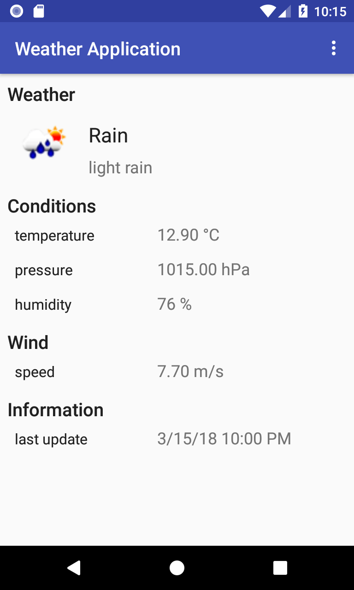

# TP4 Application météo

## Présentation

L'objectif du TP est de créer un application de météo qui va afficher :

- La météo actuelle à votre position.
- Les prévisions météo pour les 5 prochains jours.

Pour cela nous allons utiliser l'API ouverte et gratuite [OpenWeatherMap](https://openweathermap.org/api)

Un client Java pour cette API a été créé pour vous, disponible à l'adresse suivante : <https://github.com/GautierLevert/android-exercise-weather-template>

Pour faire appel à l'API il suffit d'instancier la classe `WeatherManager` et d'appeler les méthodes `findWeatherBy...()` ou `findForecastBy...()`

```Java
// récupération de la météo actuelle par nom de ville
WeatherResponse weather = weatherManager.findWeatherByCityName("Amiens");

// récupération de la météo actuelle par position géographique
WeatherResponse weather = weatherManager.findWeatherByGeographicCoordinates(49.8942, 2.2957);

// récupération des prévisions par nom de ville
ForecastResponse forecast = weatherManager.findForecastByCityName("Amiens");

// récupération des prévisions par position géographique
ForecastResponse forecast = weatherManager.findForecastByGeographicCoordinates(49.8942, 2.2957);
```

**Attention : Ces méthodes font des appels réseau et devront donc être appelées en dehors du main thread. Se référer au TP sur les [AsyncTask](https://developer.android.com/reference/android/os/AsyncTask.html)**

## Objectifs

Les objectifs sont les suivants :

1. Recherchez la météo actuelle par nom de ville.
    - Récupérer le noms d'une ville à l'aide d'une EditText
    - Attention, le téléchargement des informations doit se faire par une [AsyncTask](https://developer.android.com/reference/android/os/AsyncTask.html)
    - Pour commencer contentez vous de logger le résultat ou d'afficher une info simple

2. Affichez les informations sur la météo actuelle.
    - Température
    - Humidité
    - Pression
    - Vitesse du vent
    - Conditions
    - Plus d'informations le format des données : <https://openweathermap.org/current>

3. Créez une deuxième Activity qui permettra d'afficher les prévisions des 5 prochains jours.
    - Les données devront s'afficher dans un [RecyclerView](https://developer.android.com/guide/topics/ui/layout/recyclerview.html).
    - Afficher les même informations que pour la météo actuelle.
    - Plus d'informations sur le format des données : <https://openweathermap.org/forecast5>

4. Affichez l'icône associée à la situation météorologique.
    - Récupérez l'URL l'icône à afficher depuis le modèle
    ```Java
    weather.getIconUri()
    ```
    - Plus d'informations sur le chargement d'images : <https://developer.android.com/topic/performance/graphics/index.html>
    - La solution la plus simple consiste à utiliser [Glide](https://github.com/bumptech/glide) ou [Picasso](https://square.github.io/picasso/) (**Attention de bien ajouter la dépendance à votre projeet**)
    - Vous pouvez également utiliser une AsyncTask et l'utilitaire [BitmapFactory](https://developer.android.com/reference/android/graphics/BitmapFactory.html)

5. Demandez la permission de l'utilisateur de récupérer sa localisation et permettre d'effectuer la recherche par position (longitude et latitude).
    - demander l'autorisation d'accéder à la position de l'utilisateur (`android.permission.ACCESS_FINE_LOCATION` et `android.permission.ACCESS_COARSE_LOCATION`)
    - récupérer une instance de [LocationManager](https://developer.android.com/reference/android/location/LocationManager.html)
    - récupérer la dernière position connue à l'aide de

     ```Java
     locationManager.getLastKnownLocation(LocationManager.NETWORK_PROVIDER);
     ```
    ou
    ```Java
    locationManager.getLastKnownLocation(LocationManager.GPS_PROVIDER);
    ```

    - Si ces deux méthodes ne renvoient rien il faut passer par
    ```Java
    locationManager.requestSingleUpdate(LocationManager.NETWORK_PROVIDER, listener, null);
    ```
    ou
    ```Java
    locationManager.requestSingleUpdate(LocationManager.GPS_PROVIDER, listener, null);
    ```

## Exemple d'affichage


